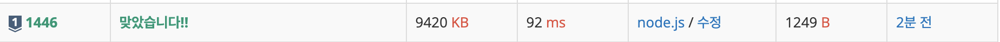

- **문제** : 백준 1446번 - 지름길
- **난이도** : 실버 1
- **문제 유형** : DP
- **푼 언어** : javascript

## 01. 문제 설명

### 문제
매일 아침, 세준이는 학교에 가기 위해서 차를 타고 D킬로미터 길이의 고속도로를 지난다. 이 고속도로는 심각하게 커브가 많아서 정말 운전하기도 힘들다. 어느 날, 세준이는 이 고속도로에 지름길이 존재한다는 것을 알게 되었다. 모든 지름길은 일방통행이고, 고속도로를 역주행할 수는 없다.

세준이가 운전해야 하는 거리의 최솟값을 출력하시오.

### 입력
첫째 줄에 지름길의 개수 N과 고속도로의 길이 D가 주어진다. N은 12 이하인 양의 정수이고, D는 10,000보다 작거나 같은 자연수이다. 다음 N개의 줄에 지름길의 시작 위치, 도착 위치, 지름길의 길이가 주어진다. 모든 위치와 길이는 10,000보다 작거나 같은 음이 아닌 정수이다. 지름길의 시작 위치는 도착 위치보다 작다.

### 출력
세준이가 운전해야하는 거리의 최솟값을 출력하시오.

## 02. 문제 풀이
문제를 풀 때 가장 먼저 시도한 것은 불필요한 데이터를 제거하는 일이었다. `start → end`로 가는 지름길 중 기존 경로보다 더 멀리 돌아가는 길은 제외했고, 중복된 지름길이 있을 경우 더 짧은 거리만 남겨 이후 계산량을 줄였다. 
이후 임의의 위치 d까지의 최단 거리를 `dp[d]`로 정의하고, 해당 위치에 도달할 때 일반 도로를 통해 오는 경우와 지름길을 통해 오는 경우를 비교하여 더 짧은 값을 선택하는 방식으로 문제를 해결했다. 이렇게 이전 상태(dp[start])를 기반으로 현재 상태(dp[d])의 최적 해를 구하는 과정에서 DP 알고리즘이 적합하다고 판단했다. 또한 목적지 d로 들어오는 지름길이 여러 개 존재하더라도 출발 지점이 서로 다르기 때문에 사전에 어떤 경로가 최단 거리인지 판단할 수 없었고, 모든 후보를 고려한 뒤 DP 계산 과정에서 자연스럽게 최단 경로를 선택하도록 구현했다.

