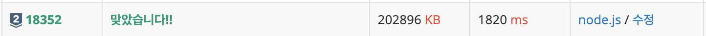

- **문제** : 백준 18352번 - 특정 거리의 도시 찾기
- **난이도** : 실버 2
- **문제 유형** : BFS
- **푼 언어** : javascript

## 01. 문제 설명

### 문제
어떤 나라에는 1번부터 N번까지의 도시와 M개의 단방향 도로가 존재한다. 모든 도로의 거리는 1이다.

이 때 특정한 도시 X로부터 출발하여 도달할 수 있는 모든 도시 중에서, 최단 거리가 정확히 K인 모든 도시들의 번호를 출력하는 프로그램을 작성하시오. 또한 출발 도시 X에서 출발 도시 X로 가는 최단 거리는 항상 0이라고 가정한다.

예를 들어 N=4, K=2, X=1일 때 다음과 같이 그래프가 구성되어 있다고 가정하자.

  
이 때 1번 도시에서 출발하여 도달할 수 있는 도시 중에서, 최단 거리가 2인 도시는 4번 도시 뿐이다.  2번과 3번 도시의 경우, 최단 거리가 1이기 때문에 출력하지 않는다.

### 입력
첫째 줄에 도시의 개수 N, 도로의 개수 M, 거리 정보 K, 출발 도시의 번호 X가 주어진다. 
(2 ≤ N ≤ 300,000, 1 ≤ M ≤ 1,000,000, 1 ≤ K ≤ 300,000, 1 ≤ X ≤ N) 

둘째 줄부터 M개의 줄에 걸쳐서 두 개의 자연수 A, B가 공백을 기준으로 구분되어 주어진다. 이는 A번 도시에서 B번 도시로 이동하는 단방향 도로가 존재한다는 의미다. (1 ≤ A, B ≤ N) 
단, A와 B는 서로 다른 자연수이다.

### 출력
X로부터 출발하여 도달할 수 있는 도시 중에서, 최단 거리가 K인 모든 도시의 번호를 한 줄에 하나씩 오름차순으로 출력한다.

이 때 도달할 수 있는 도시 중에서, 최단 거리가 K인 도시가 하나도 존재하지 않으면 -1을 출력한다.

## 02. 문제 풀이
X에서 출발해 최단 거리가 정확히 K인 모든 도시를 찾는 문제다. 이를 위해 한 단계씩 거리를 확장해 나가는 BFS 알고리즘을 사용했다. BFS는 모든 간선을 동일한 비용(=1)으로 처리할 때 최단 경로를 보장하므로 적합하다. 
또한 `1→2→3→1`처럼 사이클이 존재할 수 있으므로, 방문 체크하여 이미 방문한 도시는 다시 방문하지 않도록 구현했다.
